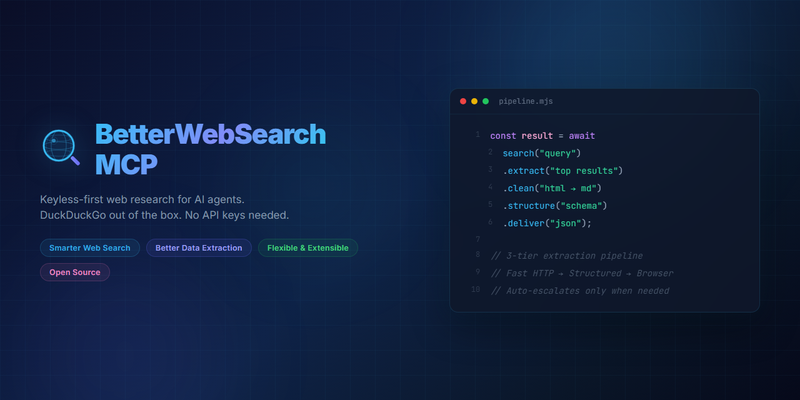

# BetterWebSearch MCP

> Keyless-first web search for AI agents. DuckDuckGo works out of the box. No API keys.

[](https://www.npmjs.com/package/better-web-search-mcp)
[](https://github.com/PhantomPixelDev/BetterWebSearch-MCP/actions)
[](https://phantompixeldev.github.io/BetterWebSearch-MCP/)
[](LICENSE)
[](https://smithery.ai/server/@PhantomPixelDev/better-web-search-mcp)

<p align="center">
  
</p>

## What is this?

BetterWebSearch MCP is a [Model Context Protocol](https://modelcontextprotocol.io) server that gives AI assistants genuinely better web research. It works without API keys by default (DuckDuckGo), and optionally adds Brave or Tavily for richer ranking and recency.

Built for anyone who wants their AI tools to find things on the web reliably, not just when a paid API key is configured.

## Quick start (30 seconds)

Add this to your MCP client config (Claude Desktop, Cursor, VS Code Copilot, OpenCode, or any MCP client):

```json
{
  "mcpServers": {
    "better-web-search-mcp": {
      "command": "npx",
      "args": ["-y", "better-web-search-mcp"]
    }
  }
}
```

That's it. Every search tool works immediately. No `.env`, no API keys, no setup.

Or run it directly:

```bash
npx -y better-web-search-mcp --help
```

## Tools

| Tool | What it does |
|---|---|
| `web_search` | Aggregated search across providers, deduplicated and reranked |
| `web_research` | Deep research. Rewrites your question, searches in parallel, extracts top results with citations |
| `deep_search` | Alias for `web_research` |
| `web_extract` | Extracts clean content from any URL, using the best method available |
| `web_find` | Search scoped to a single website |
| `web_news` | Recent news with timeline and diversity filtering |

## How search is better

Standard MCP search tools hit one API and return raw results. BetterWebSearch takes a different approach.

**Query expansion.** Your single question gets rewritten into 4 to 6 variants, searched in parallel. "Unlimited mobile internet Germany" also searches for "unbegrenztes Datenvolumen Deutschland" and similar phrasings. More coverage without you doing extra work.

**Three-tier extraction.** When it fetches a page, it doesn't just grab the HTML and hope for the best:

```
Tier 1: Fast HTTP fetch          (< 1s)
    ↓ if not enough content
Tier 2: Structured data          (JSON-LD, __NEXT_DATA__, __NUXT__)  (1-3s)
    ↓ if still not enough
Tier 3: Playwright browser       (full render + API interception)    (3-10s)
```

Only escalates when needed. Results carry confidence scores so you know what you're getting.

**Self-learning cache.** The first visit to a domain takes the full path. The second visit skips straight to what worked. Domain profiles and API patterns are remembered.

## Project structure

```
src/
  providers/      Search backends (DuckDuckGo, Brave, Tavily, SERPApi)
  extraction/     3-tier content pipeline (fetch, structured, browser)
  ranking/        Deduplication, domain scoring, reranking
  tools/          MCP tool definitions (search, research, extract, find, news)
  utils/          Config, caching, retry, query rewriting
```

## Configuration

All configuration is optional. DuckDuckGo works with zero setup.

```bash
# Optional: add more providers
BRAVE_API_KEY=your_key     # Better ranking and recency
TAVILY_API_KEY=your_key    # Alternative provider
```

See the [full configuration reference](https://phantompixeldev.github.io/BetterWebSearch-MCP/docs/configuration/) for all options including cache paths, browser settings, and environment variable names.

## Documentation

Full guides, API reference, and architecture details live on the docs site:

**[phantompixeldev.github.io/BetterWebSearch-MCP](https://phantompixeldev.github.io/BetterWebSearch-MCP/)**

- [Installation](https://phantompixeldev.github.io/BetterWebSearch-MCP/docs/installation/) - npx, npm, or from source
- [Quick Start](https://phantompixeldev.github.io/BetterWebSearch-MCP/docs/quickstart/) - Get running in your first AI client
- [Configuration](https://phantompixeldev.github.io/BetterWebSearch-MCP/docs/configuration/) - All environment variables and options
- [Contributing](https://phantompixeldev.github.io/BetterWebSearch-MCP/docs/contributing/) - Development setup and PR process
- [Changelog](CHANGELOG.md) - Release history and version notes

## License

MIT
