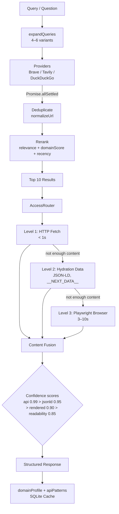

## System overview



## Components

### 1. MCP Server (`src/index.ts`)

The CLI entry point. Parses `--help` / `--version` flags (exiting before MCP handshake), then starts the stdio MCP server with all 6 tools registered.

### 2. Query Expansion (`src/utils/queries.ts`)

Rewrites the input question into 4–6 search variants, including translated versions (e.g. German). Each variant is searched in parallel.

### 3. Search Providers (`src/providers/`)

Each provider implements the `SearchProvider` interface:
- `brave.ts` — Brave Search API
- `tavily.ts` — Tavily API
- `duckduckgo.ts` — DuckDuckGo HTML scraping (keyless)
- `serpapi.ts` — Stub for future SERPApi

Aggregated via `Promise.allSettled` so one failing provider never breaks the others.

### 4. Ranking Pipeline (`src/ranking/`)

- **Deduplication** (`deduplicate.ts`) — strips tracking params, normalizes URLs
- **Re-ranking** (`rerank.ts`) — `0.5 × text_overlap + 0.2 × domain_score + 0.2 × recency + 0.1 × provider_score`

### 5. AccessRouter (`src/extraction/router.ts`)

Three-tier escalation pipeline:
- **Level 1:** HTTP fetch + Readability (< 1s)
- **Level 2:** Structured/hydration data (1–3s)
- **Level 3:** Playwright browser pool (3–10s)

Only escalates when the current tier doesn't produce enough content.

### 6. Content Fusion (`src/extraction/fusion.ts`)

Merges results from multiple extraction strategies. Picks the winner by confidence score. Structured data and API endpoints from all strategies are merged.

### 7. Self-learning Cache (`src/utils/cache.ts`)

SQLite-backed (WAL mode) with in-memory fallback:
- `search_cache` — 15 min TTL
- `page_cache` — 1 hr TTL
- `domain_profiles` — permanent (self-learning per domain)
- `api_patterns` — permanent (discovered API endpoints)

### 8. Config Loader (`src/utils/config.ts`)

Central keyless-first configuration. Resolves env vars with aliases, prints the provider banner, and exposes the `AppConfig` interface.

## Data flow

```
User question
  → expandQueries (4–6 variants)
  → aggregateSearch (all providers, Promise.allSettled)
  → deduplicate (normalize URLs)
  → rerank (relevance + domain + recency + score)
  → top 10 results
  → AccessRouter (per-URL, bounded concurrency 3, 8s timeout)
    → cache hit? → return cached
    → Level 1: fetchPage → readability
    → Level 2: extractStructuredData (JSON-LD, __NEXT_DATA__, __NUXT__)
    → Level 3: BrowserPool.renderWithBrowser (API intercept + DOM)
    → best-effort fallback
  → fuseContent (highest confidence wins)
  → updateDomainProfile + recordApiPatterns (self-learning)
  → structured response with confidence scores
```

## Key design decisions

| Decision | Rationale |
|---|---|
| **Keyless-first** | Zero-config adoption; DuckDuckGo as always-on fallback |
| **`Promise.allSettled`** | One failing provider never breaks the aggregate |
| **3-tier escalation** | Fast paths for simple pages; browser only when needed |
| **Self-learning cache** | Second visit to any domain skips expensive extraction |
| **Bounded concurrency** | Max 3 browser instances; 8s per-page timeout |
| **Evidence-typed results** | Every result carries `{method, confidence, type}` for transparency |

## Project structure

```
src/
  index.ts          # CLI entry point (MCP stdio server)
  tools/            # MCP tool definitions (zod schemas)
  providers/        # SearchProvider implementations (Brave, Tavily, DuckDuckGo)
  extraction/       # 3-tier extraction: HTTP → hydration → Playwright
  ranking/          # Deduplication and re-ranking
  utils/            # Config, cache, query expansion helpers
scripts/            # Postinstall checks, smoke test
dist/               # Compiled output (gitignored)
data/               # Runtime SQLite cache (gitignored)
```
